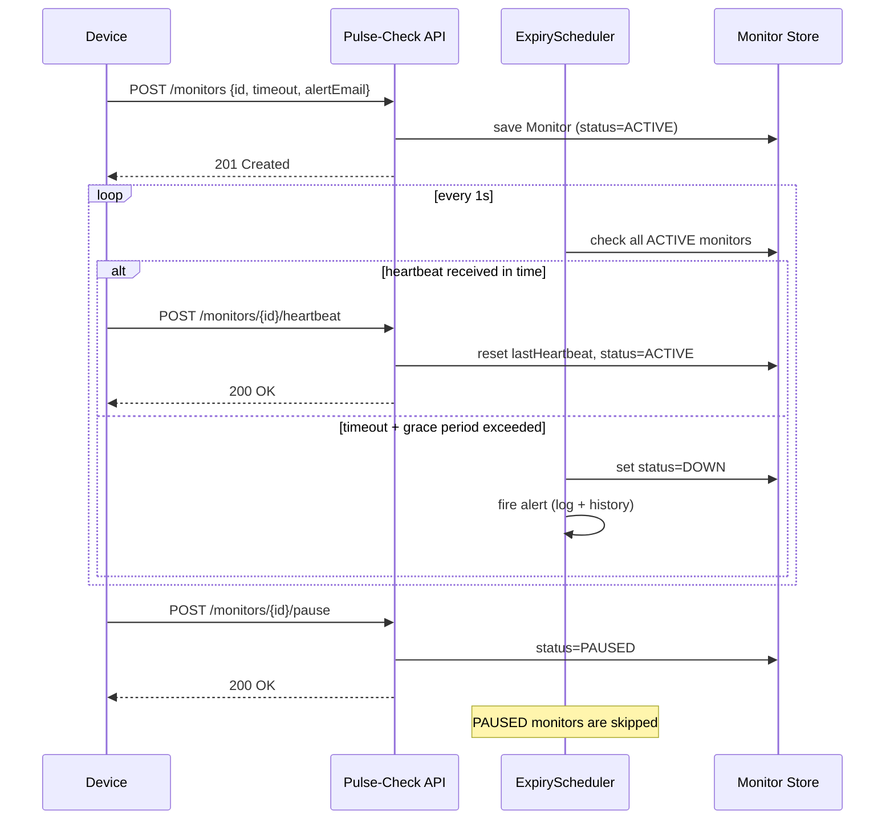

# Pulse-Check API ("Watchdog" Sentinel)

A dead man's switch service for monitoring remote devices with unreliable connectivity. Devices register a timeout window and send periodic heartbeats; if a device goes silent past its window, the system flags it as down and fires an alert.

Built for CritMon Servers Inc. to replace manual log-checking for solar farm and weather station uptime.

## Architecture Diagram



## Setup Instructions

**Requirements:** Java 21, Maven (or use the bundled wrapper)

```bash
git clone https://github.com/Cycy-e/AmaliTech-DEG-Project-based-challenges.git
cd AmaliTech-DEG-Project-based-challenges/backend/Pulse-Check
./mvnw spring-boot:run          # Mac/Linux
.\mvnw.cmd spring-boot:run      # Windows
```

Server starts on `http://localhost:8080`.

## API Documentation

### Register a monitor
```
POST /monitors
Content-Type: application/json

{
  "id": "device-123",
  "timeout": 60,
  "alertEmail": "admin@critmon.com"
}
```
**Response:** `201 Created`
```json
{ "message": "Monitor device-123 registered" }
```

### Send a heartbeat
```
POST /monitors/{id}/heartbeat
```
Resets the countdown. Also un-pauses a paused monitor.

**Response:** `200 OK` or `404 Not Found` if the id doesn't exist.

### Pause a monitor
```
POST /monitors/{id}/pause
```
Stops the countdown entirely — no alerts fire while paused. Calling `heartbeat` resumes it.

**Response:** `200 OK` or `404 Not Found`.

### List all monitors
```
GET /monitors
```
Returns the full state of every registered monitor, including current `status`.

### Get one monitor
```
GET /monitors/{id}
```
**Response:** `200 OK` with the monitor object, or `404 Not Found`.

### View alert history
```
GET /monitors/alerts
```
Returns a list of every alert fired since the server started, in the format:
```json
{"ALERT": "Device device-123 is down!", "time": "2026-08-29T17:48:58Z"}
```

## Design Decisions

- **In-memory storage (`ConcurrentHashMap`)** — sufficient for this scope and avoids the overhead of standing up a database. Chosen `ConcurrentHashMap` specifically because the scheduler thread and HTTP request threads both read/write monitor state concurrently.
- **Polling scheduler (`@Scheduled`, 1-second interval)** over a per-monitor timer thread — simpler to reason about, easier to test, and scales fine at this problem's size. A per-device thread approach would be harder to manage cleanly as monitor count grows.
- **Separated `MonitorService` and `AlertService`** — state management and notification are different responsibilities. This also means swapping console logging for a real email/webhook integration later only touches one class.
- **`Optional<Monitor>` for lookups** — forces explicit handling of the "not found" case instead of risking null pointer errors.

## Developer's Choice: Grace Period Tolerance

**The problem:** The original spec fires a DOWN alert the instant a monitor's timeout is exceeded — even by a single second. But per the brief, CritMon's devices operate in **areas with poor connectivity** (remote solar farms, unmanned weather stations). In that environment, a single missed heartbeat is far more likely to be a transient network hiccup than an actual failure.

**Why it matters:** Without tolerance for this, the system would generate frequent false alarms. In real operations, this leads to alert fatigue — support engineers start ignoring notifications, which quietly defeats the entire purpose of a dead man's switch. A monitoring system that cries wolf is worse than one with slightly slower detection.

**What I built:** A 5-second grace period added on top of each monitor's configured timeout before a DOWN alert fires. A device isn't marked down until `timeout + 5s` of silence, giving genuine transient lag a chance to resolve while still detecting real outages promptly. This mirrors patterns used in production systems like Kubernetes liveness probes and PagerDuty escalation delays, for the same underlying reason.

**Additional improvements included:**
- `GET /monitors` and `GET /monitors/{id}` — the original spec had no way to read monitor state back, which is a significant gap for a monitoring product whose entire value is visibility.
- `GET /monitors/alerts` — an in-memory alert history, so past alerts aren't lost the moment they scroll out of the console log.

## Tech Stack

Java 21, Spring Boot 4.1.1, Maven.